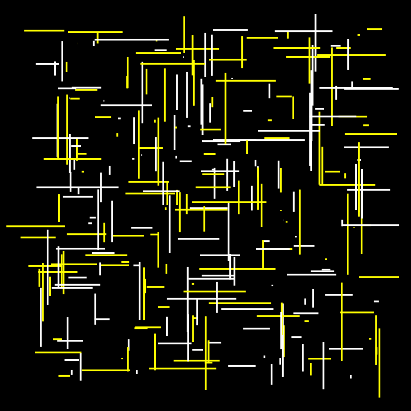

```{r setup, include=FALSE}
knitr::opts_chunk$set(echo = FALSE)
```

```{r}
library(ggplot2)
library(treemapify)
library(Lock5Data)
data("CollegeScores")
CollegeData = CollegeScores[complete.cases(CollegeScores), ]
```

# **📊 Dashboard**: Interactive tool for teaching confidence intervals
Data: Simulated sampling distributions that can be designed by the user 
Variables: Population mean, standard deviation, and size. Sampling size and number of groups. Confidence level and adjust categorical values.

This visualization allow allows the mean, standard deviation, and size of the sample population to be adjusted. Then for the sampling distribution, variables such as group size and number of groups can be changed. These interactive features allow a user to problem solve and understand visually what a confidence interval is along with short descriptions of each work.

<div style="width: 100vw; margin-left: calc(-50vw + 50%);">
  <iframe 
    src="https://abby-flynt.shinyapps.io/ConfidenceLevels_Dashboard_Team5/" 
    width="100%" 
    height="800px" 
    style="border:none;">
  </iframe>
</div>


## **🚗 Treemap**: Car performance comparison using `mtcars`  
Data: 1974 Motor Trend US magazine

Variables: Horsepower, MPG, and Model names

Description: Using a tree plot I constructed a visualization that displays horsepower as the area of each box, MPG (miles per gallon) as the color, and the model name as a label. This visualization clearly displays that with a rise in horsepower there is often a trade off in efficiency. 

```{r}
ggplot(mtcars, aes(area = hp, fill = mpg, label = rownames(mtcars))) +
  geom_treemap() +
  geom_treemap_text(color = "white", place = "center") +
  scale_fill_gradient(low = "lightblue", high = "darkblue") +
  labs(title = "Treemap of Cars by Horsepower and MPG", fill = "Miles per Gallon (mpg)")
```

## **🎨Generative Art Gallery**: aRtsy package

<div style="display: flex; justify-content: space-between; gap: 10px; margin: 20px 0;">
<div style="width: 32%; text-align: center;">  <p><strong>Title:</strong> "Bucknell Blue"</p> </div> 
<div style="width: 32%; text-align: center;">  <p><strong>Title:</strong> "Smoke Signals"</p> </div> 
<div style="width: 32%; text-align: center;">  <p><strong>Title:</strong> "Geometric Harmony"</p> </div> </div>

## **🦬 Bucknell Visualization**: Exploring Price Disparity in Education
Data: Third Edition of Lock5Data "CollegeScores" Data set

Variables: Net Price, Average Debt, and Median Income

Description: This visualization highlights Bucknell as an institution that has an extremely high tuition but has many students leaving with little to no debt due to the median income being higher. This goes against a natural way of thinking that a more expensive institution would have students with more debt but the high price keeps people who can not afford it from being able to attend Bucknell.

```{r}
ggplot(CollegeData, aes(x = NetPrice, y = Debt)) +
  geom_point(aes(size = MedIncome),
             fill = "orange", color = "black", shape = 21, stroke = 0.5) +
  geom_point(data = subset(CollegeData, Name == "Bucknell University"),
             aes(size = MedIncome),
             fill = "blue", color = "black", shape = 21, stroke = 0.5) +
  ggtitle("Comparing the Net Price and Debt at Bucknell") +
  scale_size_continuous(name = "Median Income",
                        breaks = c(10, 50, 90, 130),
                        labels = c(10, 50, 90, 130)) +
  labs(x = "Net Price", y = "Average Debt")

```

## **📚 College Data**: Completion and Admissions

Data: Third Edition of Lock5Data "CollegeScores" Data set

Variables: College Admission Rates and College Completion Rates

Description: This contour plot shows the relationship between admission rates and student completion by showing the density for where a majority of colleges place and the outlines for each value. 

```{r}
ggplot(CollegeData, aes(AdmitRate, CompRate/100)) +
  stat_density_2d(aes(fill = after_stat(level)), geom="polygon",bins = 8, alpha = .8,adjust =2) +
  stat_density_2d(color = "white",bins = 9,adjust = 2) +
  scale_fill_gradient(low = "#660066",high = "white", name = "Density") +
  scale_x_continuous(labels = scales::percent,limits=c(0,1)) +
  scale_y_continuous(labels = scales::percent,limits=c(0,1)) +
  geom_point(shape = 4,alpha = .7,size = 1) + labs(title = "Students Coming in & Going out",
x = "Admission Rate",
y = "Completion Rate") +
  theme_minimal()
```

